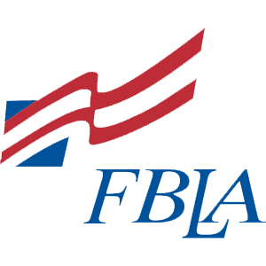

# FBLA Tourism

**Coding & Programming project for FBLA 2022**  
**Copyright &copy; 2022 Noam Hashash, Kyler Tran, Edison Zeng**
**All Rights Reserved**

FBLA Tourism lets you discover tourist attractions and amenities around Seattle, WA. This software runs on all modern web browsers.

## Main Features
- Ability to search through Google's immense database of places.
- All preferences and favorites saved in your browser's cache.
- Ability to export favorites to PDF file.
- Easily toggle between light & dark mode.
- View integrated Google map with interactive controls.
- See place details and get convenient directions.

## Search Filters Supported
- Keyword search.
- Type of place.
- Average user rating.
- Only show open businesses.
- Price range.

## Attributions
- **FBLA Logo**: Trademarked by the Future Business Leaders of America (FBLA).
- **Google Maps & Places API**: Powered by Google. Users are bound by [Google’s Terms of Service](https://google.com/intl/en/policies/terms) and [Privacy Policy](https://policies.google.com/privacy).
- [JQuery Javascript Library](https://jquery.com/)
- **FBLA Tourism**: Distributed under AGPL. [Read more here.](https://www.gnu.org/licenses/agpl-3.0.en.html)
- [Moon Icon by Ex Eyecon](https://iconscout.com/icons/moon)
- [Sun Icon by Amedia Utvikling](https://iconscout.com/icon/sun-631)

## Contact

**Kyler Tran**  
Email: [contact@kylertran.com](mailto:contact@kylertran.com)
